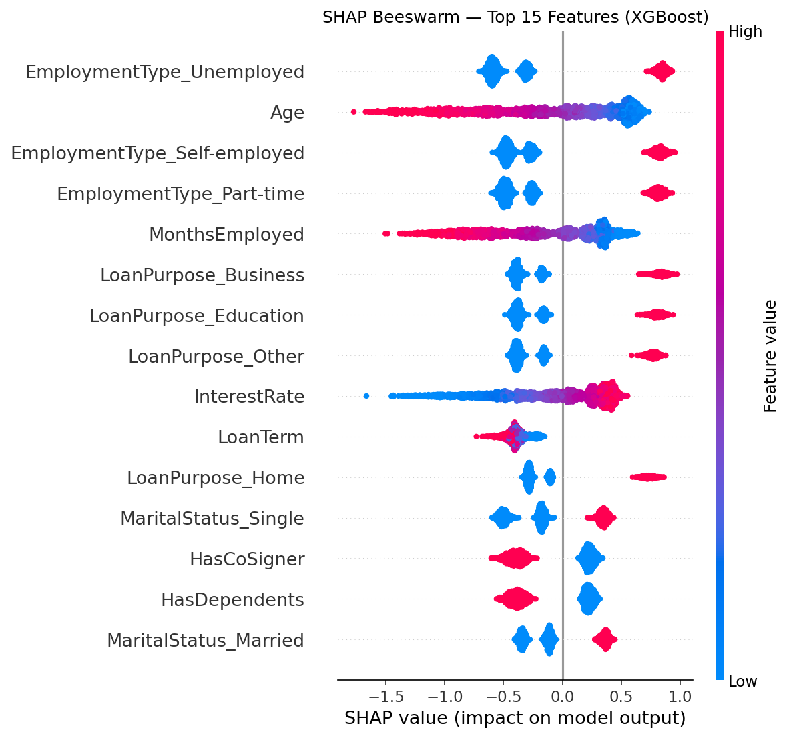
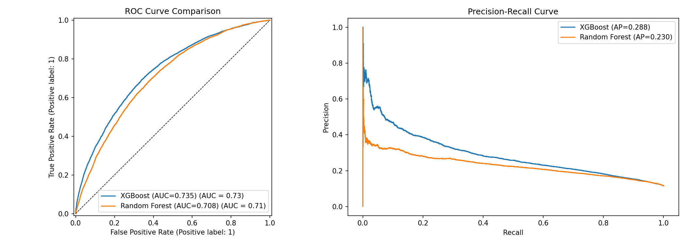
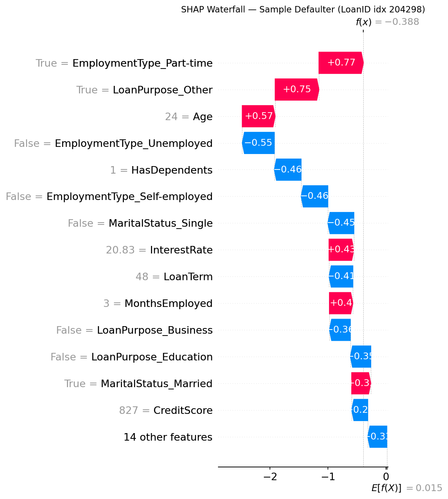

# 🏦 Loan Default Prediction

A machine learning pipeline that predicts whether a borrower will default on a loan, using XGBoost and Random Forest with SHAP explainability and MLflow experiment tracking.

---

## 📌 Problem Statement

Financial institutions lose billions annually to loan defaults. This project builds a binary classifier to identify high-risk borrowers **before** loan approval, using demographic and financial features. The model provides both predictions and human-readable explanations via SHAP values — making it suitable for real-world credit risk teams.

---

## 📊 Dataset

**Source:** [Loan Default Dataset — Kaggle (nikhil1e9)](https://www.kaggle.com/datasets/nikhil1e9/loan-default)

| Property | Value |
|---|---|
| Rows | 255,347 |
| Features | 18 |
| Target | `Default` (0 = repaid, 1 = defaulted) |
| Class imbalance | ~88% No Default / ~12% Default |

**Key features:**

| Feature | Description |
|---|---|
| `Age` | Borrower's age |
| `Income` | Annual income |
| `LoanAmount` | Amount borrowed |
| `CreditScore` | FICO-style credit score |
| `MonthsEmployed` | Employment duration |
| `DTIRatio` | Debt-to-income ratio |
| `InterestRate` | Loan interest rate (%) |
| `LoanTerm` | Repayment term in months |
| `EmploymentType` | Full-time / Part-time / Self-employed / Unemployed |
| `LoanPurpose` | Home / Auto / Education / Business / Other |

> ⚠️ The dataset CSV is not included in this repo due to size. Download it directly from the Kaggle link above and place it as `Loan_default.csv` in the project root.

---

## 🔧 Tech Stack


- **Data:** `pandas`, `numpy`
- **Modeling:** `scikit-learn`, `xgboost`
- **Imbalance:** `imbalanced-learn` (SMOTE)
- **Explainability:** `shap`
- **Tracking:** `mlflow`
- **Visualization:** `matplotlib`, `seaborn`

---

## 🗂️ Project Structure

```
Loan_prediction/
│
├── src/
│   └── loan_default_pipeline.py   # Full pipeline (EDA → training → SHAP → MLflow)
│
├── outputs/
│   ├── feature_importance.csv     # SHAP-ranked feature importance
│   └── plots/                     # All generated plots (PNG)
│
├── requirements.txt
├── .gitignore
└── README.md
```

---

## 🚀 Pipeline Overview

```
Raw CSV
   │
   ▼
Step 1 — Load & Inspect          (shape, dtypes, missing values)
   │
   ▼
Step 2 — EDA                     (distributions, correlation, default rates by category)
   │
   ▼
Step 3 — Feature Engineering     (6 new ratio features, encoding, SMOTE)
   │
   ▼
Step 4 — Train Models            (XGBoost + Random Forest)
   │
   ▼
Step 5 — SHAP Explainability     (beeswarm, waterfall, dependence plots)
   │
   ▼
Step 6 — MLflow Tracking         (log params, metrics, artifacts)
   │
   ▼
Step 7 — Save Models             (.pkl + feature_importance.csv)
```

---

## ⚙️ Feature Engineering

Six new features were derived from existing columns:

| New Feature | Formula | Intuition |
|---|---|---|
| `LoanToIncome` | LoanAmount / Income | Affordability ratio |
| `LoanAmountPerMonth` | LoanAmount / LoanTerm | Monthly burden |
| `IncomePerMonth` | Income / 12 | Normalized income |
| `DebtLoad` | DTIRatio × Income | Absolute debt amount |
| `CreditUtilization` | LoanAmount / CreditScore | Risk-adjusted borrowing |
| `EmployedYears` | MonthsEmployed / 12 | Stability metric |

Class imbalance (88/12 split) was handled with **SMOTE** on the training set only.

---

## 📈 Results

| Model | AUC-ROC | Precision (Default) | Recall (Default) | F1 (Default) | Accuracy |
|---|---|---|---|---|---|
| XGBoost | 0.7349 | 0.39 | 0.19 | 0.25 | 0.87 |
| Random Forest | 0.7075 | 0.26 | 0.32 | 0.29 | 0.81 |

> ✅ **XGBoost** is the best performing model with AUC-ROC of **0.7349**.

### Confusion Matrix — XGBoost
| | Predicted No Default | Predicted Default |
|---|---|---|
| **Actual No Default** | 43,444 ✅ | 1,695 ❌ |
| **Actual Default** | 4,831 ❌ | 1,100 ✅ |

> The low Default recall (0.19) is expected with a heavily imbalanced dataset (88/12 split). SMOTE was applied to the training set to partially address this.

---

## 🖼️ SHAP Explainability

SHAP (SHapley Additive exPlanations) was used to explain both global model behavior and individual predictions.

**Global feature importance (beeswarm):**



**ROC Curve & Precision-Recall Curve:**



**Single prediction waterfall (for a real defaulter in the test set):**



> Each bar shows how much a feature pushed the prediction toward default (red) or away from it (blue).

---

## 🛠️ How to Run

### 1. Clone the repo
```bash
git clone https://github.com/Thinuridesilva/Loan_prediction.git
cd Loan_prediction
```

### 2. Install dependencies
```bash
pip install -r requirements.txt
```

### 3. Add the dataset
Download `Loan_default.csv` from [Kaggle](https://www.kaggle.com/datasets/nikhil1e9/loan-default) and place it in the project root.

### 4. Run the pipeline
```bash
python src/loan_default_pipeline.py
```

### 5. View MLflow experiments
```bash
mlflow ui
# Open http://localhost:5000
```

---

## 🔮 Future Work

- [ ] FastAPI REST endpoint for real-time predictions
- [ ] Docker containerization for deployment
- [ ] Optuna hyperparameter tuning
- [ ] Threshold optimization for business cost minimization
- [ ] GitHub Actions CI/CD pipeline
- [ ] Streamlit dashboard for interactive predictions

---

## 👩‍💻 Author

**Thinuri Desilva**
Undergraduate — BSc Engineering
Interested in ML Engineering internships

[](https://github.com/Thinuridesilva)

---

## 📄 License

This project is licensed under the MIT License.
